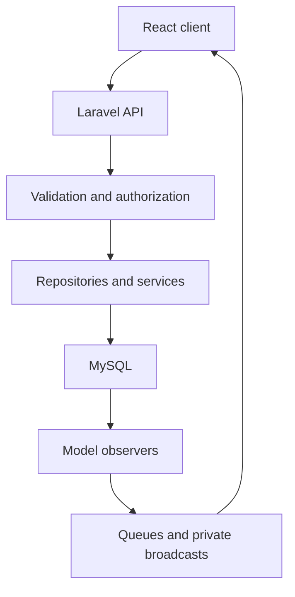

# Architecture

React calls the versioned Laravel HTTP API with Sanctum Bearer tokens. Controllers validate input and authorize resources; repositories perform persistence/query work; services coordinate domain policy and multi-record operations. Eloquent models and observers remain part of the architecture.

This is a responsibility overview, not a claim that every legacy path has identical layering. Controllers still sometimes compose repository/reducer work directly.

## Decisions

- [0001 — Sanctum Bearer authentication](adr/0001-authentication.md)
- [0002 — Repository and service boundaries](adr/0002-boundaries.md)
- [0003 — Side effects after commit](adr/0003-events.md)
- [0004 — Reciprocal match transaction](adr/0004-matches.md)
- [0005 — Versioned API and explicit contracts](adr/0005-api-contracts.md)

[API guide](../api/README.md) · [Observer flows](../EVENT_FLOWS.md) · [Critical flow coverage](../testing/CRITICAL_FLOW_COVERAGE.md)
